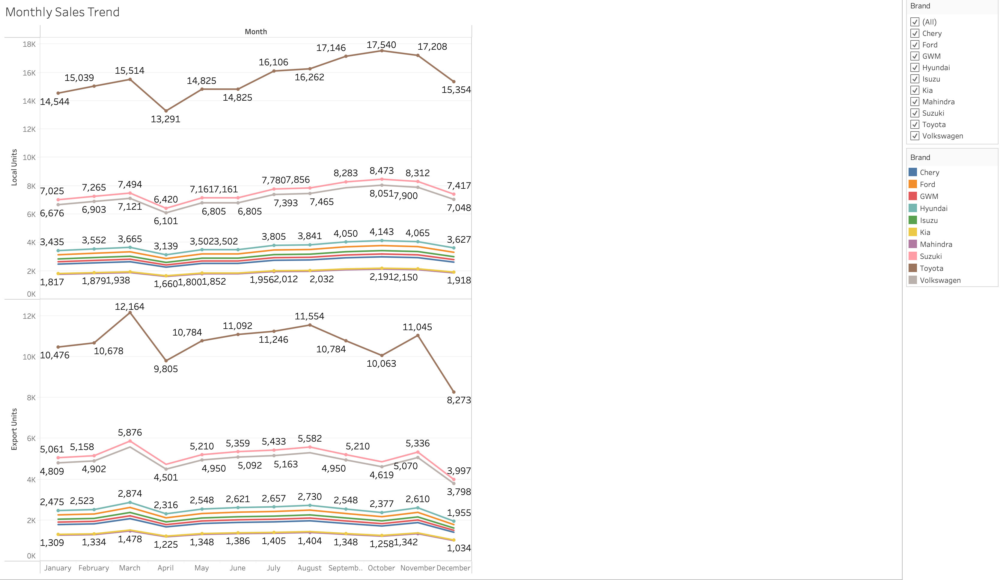
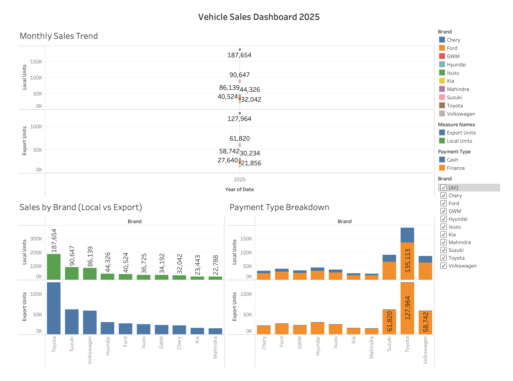

# Vehicle Sales Dashboard 2025

## 📊 Project Overview

This project showcases a Tableau dashboard analyzing South African vehicle sales for 2025, focusing on brand performance, payment types (Cash vs Finance), and local vs export unit trends.

The dataset was sourced from **NAAMSA** (National Association of Automobile Manufacturers of South Africa) and consolidated into a single CSV. Some missing monthly figures were **interpolated** to create a continuous dataset. As a result, figures may not be 100% exact and are intended to **demonstrate analytical, data cleaning, and visualization skills** rather than serve as official statistics.

The goal of this project is to demonstrate practical data analysis workflow: preparing raw data, building clear visualizations, and presenting insights in a business-friendly dashboard.

---

## Key Insights
- Finance purchases significantly outweigh cash purchases across all brands.
- Toyota and Suzuki consistently lead total unit sales.
- Local sales dominate overall volume compared to exports.
- Brand performance remains relatively stable month-to-month.
- Chinese manufacturers (e.g., Chery, GWM) show strong growth in sales volume during 2025, indicating a shifting competitive landscape and increasing pressure on established legacy brands.

## Skills Demonstrated
- Tableau Public: dashboard design, charts, and filters  
- Data Analysis: transaction and sales trends, local vs export performance  
- **SQL & Data Hygiene:** cleaning, validating, and preparing datasets for accurate reporting  
- KPI Tracking: monitoring brand sales performance over time  
- Data Visualization: line charts, bar charts, and comparative analysis  
- Dashboard Development: interactive filters, clear labeling, and layout  

---

## Dashboard Highlights
1. **Brand Sales Overview:** Compare local and export units by brand  
     

2. **Monthly Sales Trends:** Track sales performance over the year  
     

3. **Payment Type Analysis:** Breakdown of Cash vs Finance transactions  
     

4. **Interactive Dashboard:** Combine all insights in a single view with filters for **Brand**, **Year**, and **Payment Type**  
     

---

## Files Included
- `Vehicle_Sales_Dashboard_2025.twbx` → Interactive Tableau workbook  
- `Vehicle_Sales_Dashboard_2025.jpg` → Full dashboard screenshot  
- `/screenshots/` → Individual chart screenshots  
- `dataset.csv` → Cleaned source data  

---

## How to View
1. Open the `.twbx` in **Tableau Public or Tableau Desktop** to interact with filters and charts  
2. Or review the **screenshots** for a quick view of the dashboard design and insights  

---

💡 **Tip for Recruiters/Portfolio:**  
This dashboard demonstrates the ability to **clean data, analyze trends, and build interactive dashboards** ready for operational or business insights.
